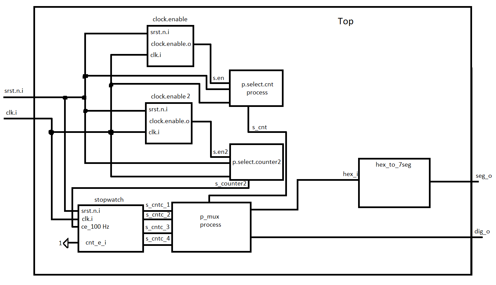
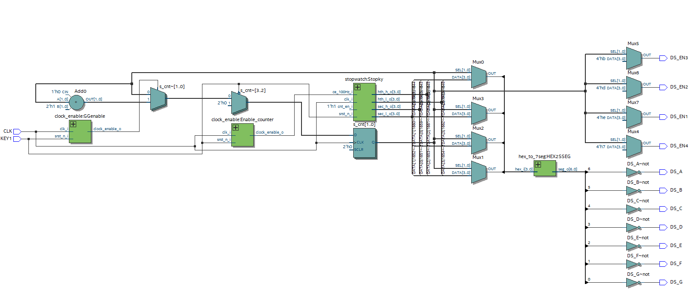

# Projekt stop watch

## Blokové schéma modulu TOP

# Implementace na Altera Cyclone IV E
Pro lepší vizualizaci a kontrolu byla provedena implementace na vývojové desce s FPGA Altera Cyclone IV E. Viz složka counter. Zde soubor counter.vhd lze považovat za TOP modul, nicméně vstupy a výstupy mají jiné názvy z pochopitelných důvodů než pro desku COOLRUNNER. Stejně tak neodpovídají hodnoty pro čítače clock_enable, jelikož je na této desce fixní frekvence CLK 48 MHz.

## Blokové schéma

