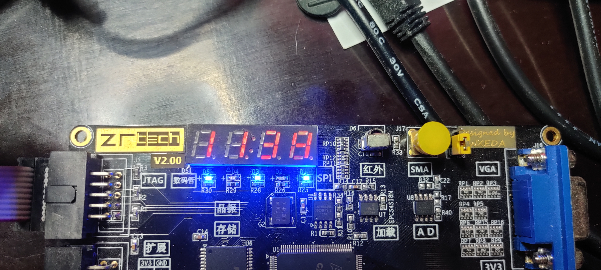

# Projekt stop watch

# Implementace na Altera Cyclone IV E
Pro lepší vizualizaci a kontrolu byla provedena implementace na vývojové desce s FPGA Altera cyclone IV E. Viz složka counter. Zde soubor counter.vhd lze považovat za TOP modul, nicméně vstupy a výstupy mají jiné názvy z pochopitelných důvodů než pro desku COOLRUNNER. 

