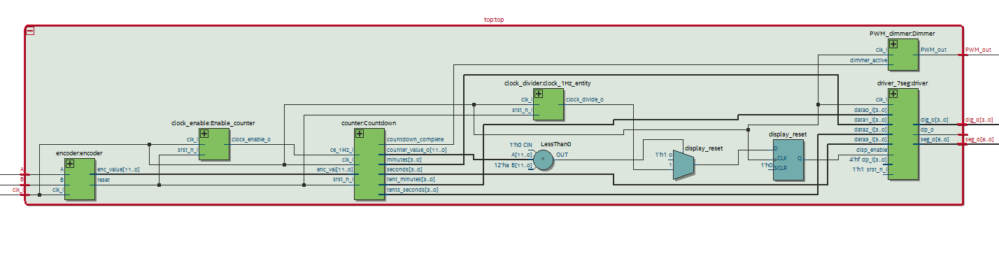

# Project
## General description
The circuit can perform a slow dimming of output device like LED through PWM after the set time has expired. The remaining time can be set by rotary encoder. The maximmum time to count down is set to 1 Hour and can be set in increments of seconds. For convenience the remaining time is displayed on group of four 7 segment displays in MM:SS format. When the remaining time is less or equal to 10 seconds the display starts to blink to attract the attendance of user and remains blinking after the time has expired. When the time has expired the output is also slowly dimmed through PWM. The frequency of the PWM is roughly 100 Hz and the dimming is performed in 100 steps every PWM cycle so that the total dimming time is 1 second.

## Modules and block diagram

Chart has been generated in Quartus prime lite for better visuals than RTL viewer in Xilinx ise. The inputs A and B are two outputs of the encoder, the outpus PWM are for the LED or electronics driving larger light sources. 

### Counter Module
Counter module works as the main countdown for the light, in addition it works in cooperation with hex27seg as binary to clock ( MM:SS) converter. It performs division of the current counter value by 600 (tenths of minutes) , 60 (minutes), 10 (tenths of seconds), 1( seconds), to convert the counter value to current remaining time. The other and in fact main function of this module is to countdown the main counter, since the period of the counter is defined to be 1 second the counter value is in seconds. So the module decrements the current counter value by 1 every second and then executes the conversion to MM:SS format. Because this conversion can take different amount of time for different counter values and the main clock frequency is quite low (10 kHz) the display is synchronously updated so that, the change of digits on display appears to change in intervals of the same lenght.

