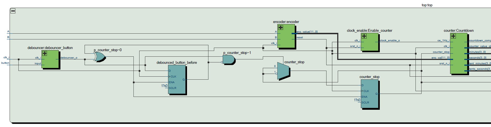
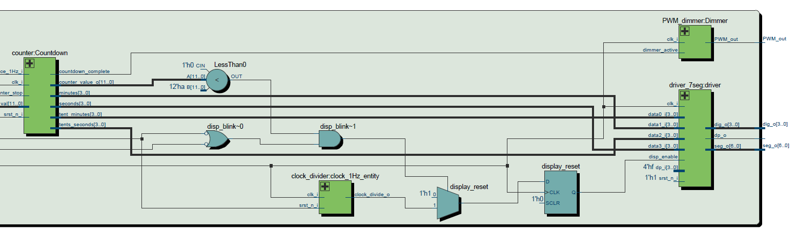
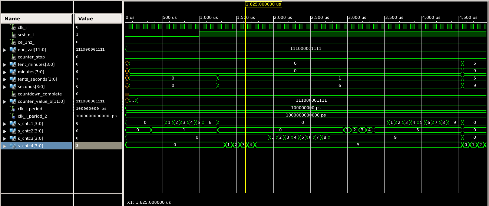
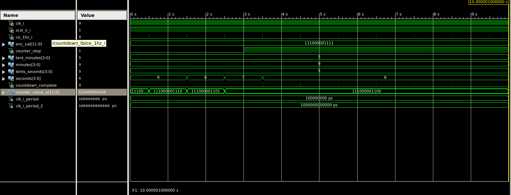
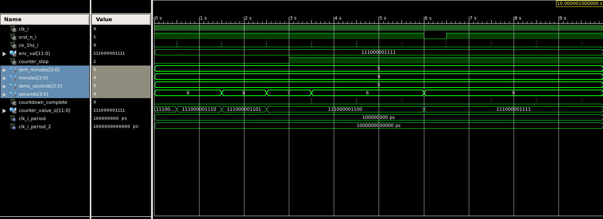
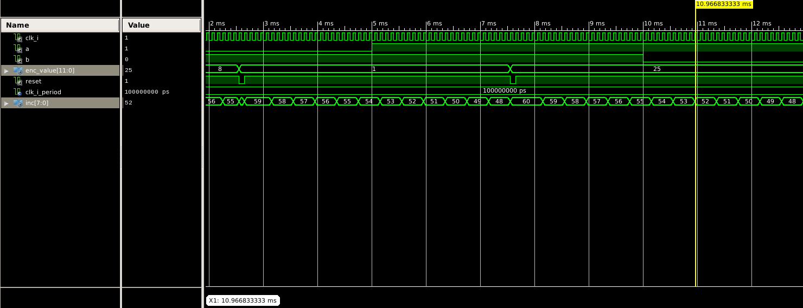
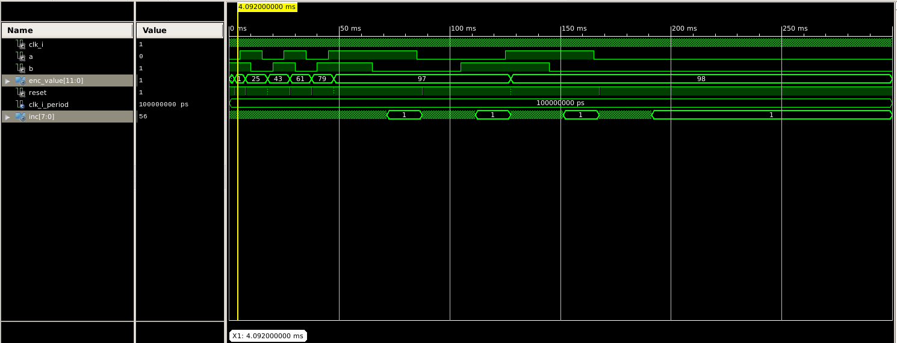
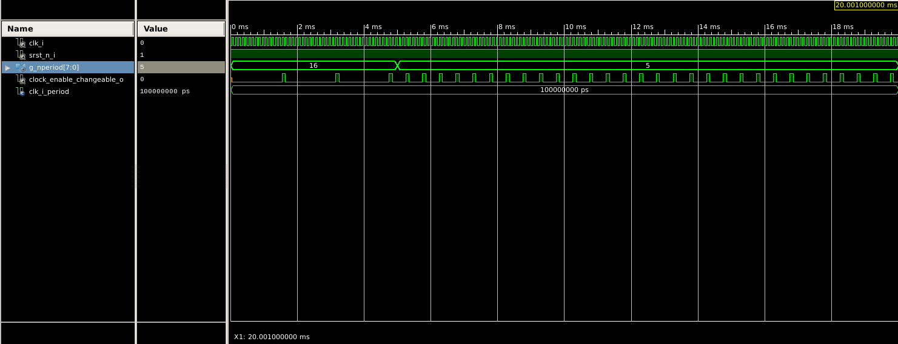
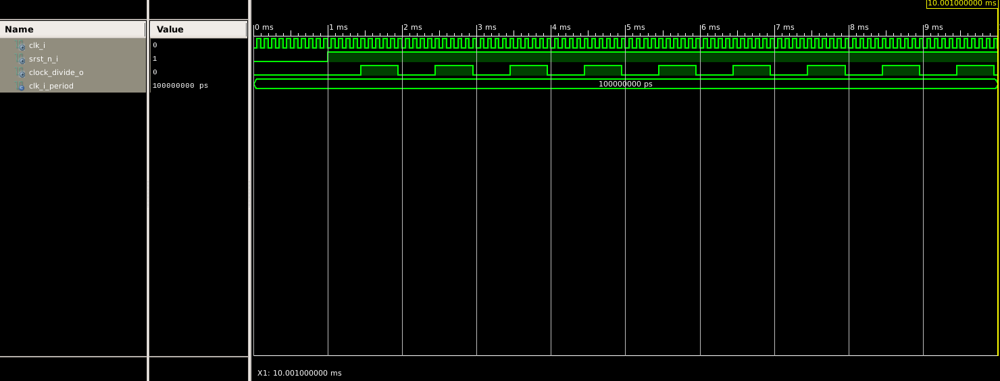

# Project
## General description
The circuit can perform a slow dimming of output device like LED through PWM after the set time has expired. The remaining time can be set by rotary encoder. The maximmum time to count down is set to 1 Hour and can be set in increments of seconds. Since it could take considerable amount of time to set the countdown to large values, the encoder module uses simple velocity control, so that when turning the knob fast the increment of the encoder value rises as well. For convenience the remaining time is displayed on group of four 7 segment displays in MM:SS format. When the remaining time is less or equal to 10 seconds the display starts to blink to attract the attendance of user and remains blinking after the time has expired. When the time has expired the output is also slowly dimmed through PWM. The frequency of the PWM is 100 Hz and the dimming is performed in 100 steps every PWM cycle so that the total dimming time is 1 second. The button of encoder can be used to stop and start the timer and turn on the light.

## Modules and block chart

The chart has been generated in Quartus prime lite for better visuals than RTL viewer in Xilinx ise. The inputs A and B are two outputs of the encoder, the outpus PWM are for the LED or electronics driving larger light sources. 

### Counter Module
Counter module works as the main countdown for the light, in addition it works in cooperation with driver7seg module as binary to clock ( MM:SS) converter. It performs division of the current counter value by 600 (tenths of minutes) , 60 (minutes), 10 (tenths of seconds), 1( seconds), to convert the counter value to current remaining time. This conversion is guaranteed to take less than one second since every substraction takes one clock cycle, so even if we were tu substract one second everytime, if the maximmum counter values is 3600 seconds (which it infact is) then the conversion would take 3600 clock cycles while the second takes 10 000 clock cycles, so there should be no problem in unfinished conversion when moving it to display. In addition there is a buffer register where the value is altered only and if the conversion has been completed, this further ensures that no unfinished conversions are followed to display registers,from this buffer the display is updated synchronously with the seconds tick, so the display is updated every second. Because this could cause inconvinience when setting the remaining time by encoder (refresh rate of 1 Hz), the display is refreshed also when the knob is turned, this is sensed by the input reset signal. 

The other and in fact main function of this module is to countdown the main counter, since the period of the counter is defined to be 1 second the counter value is in seconds. So the module decrements the current counter value by 1 every second and then executes the conversion to MM:SS format. Because this conversion can take different amount of time for different counter values and the main clock frequency is quite low (10 kHz) the display is synchronously updated so that, the change of digits on display appears to change in intervals of the same lenght.

#### Conversion simulation

This picture shows the conversion of counter value od 3599 s to MM:SS format (59:59). The conversion can be seen in s_cntc1-4 registers, the displayed numbers are in decimal format.

#### Simulation of stop feature and countdown

This picture shows the stop feature, when the countdown_stop signal is switched to 1 the counting down stops where it is. The first second takes logner, due to poor implementation of ce_1Hz signal in simulation, it does not happen in reality.

#### Simulation of reset

This picture shows the reset, when the reset is pulled down, which signalizes the change of value in encoder, the value of countdown counter is reset to the current counter value (59:59).

### Encoder Module
Encoder module has responsibility to read the movement of rotary encoder. It uses simple detection of movement using one output pin of rotary encoder while checking the value of the other one it decides wheter it should increase or decrease the counter value i.e. the knob has been turned clockwise or counterclockwise. For better usability when the knob is beeing turned for longer amount of time and with certain speed the increment increases as well. So if turning slowly the increment is 1 second, when turning faster the increment can rise up to 30 seconds. 

#### Simulation of velocity controll

This picture shows the function of velocity controll, since the encoder is spinned at fast pace, the increment rises. Since the used encoder inceremnts by 2 every indent the output value of encoder is divided by two, therefore the real increment is half to what shows the simulation. This ensures that when turning the knob slowly we can achieve one seconds increments per indent. This loweres the number of pulses per revolution of encoder, but since we use this velocity controll this disadvantage is not noticable.  

This simulation output further shows the situation when the knob is turned at slower pace when the increment is one.

### Clock enable module
This module is used several times throughout the design and it is used to divide the input clock by creating enable signal which is high every n clock periods. The duration of this pulse is equal to one clock half period. This module has been discussed and described in corresponding lab which can be seen under labs folder in the root directory of this repository.

### Clock enable changeable module
This module works as a clock enable module but its value can be change on the fly, this block is used in dimmer module to generate different duty cycles. Furthermore, since we never use values greater than 100 the bit width of setup register is changed from 16 to 8 bits.

#### Simulaton of clock enable changeable module

 We can see that after the input value of the module has changed so did the output period.
### Clock Divider Module
This module divides the clock in contrast to clock_enable module, it does not generate pulses of one clock half period length, but it creates equal lenght of high and low values, this block is used for display blinking when the countdown is about to end. This is decided in disp_blink process, which either connects the display enable signal to 1 or the output of clock divider module, which period is set to 500 ms.

This picture shows the clock division 1:10, this generated clock would not be used to synchronized anything according to recommendations, so it is used only for display blinking.

### Driver7seg Module
This module is used to drive the four 7-segment displays to show the remaining time, it complies of hexadecimal (binary) to output digits converter and mux to update each digit separately, since the wiring diagram does not allow to drive all of them all at once. In addition to implementation which has been done during the labs this module has a turn off signal, which can shut the display down completely (turn off all digits), in this design it is used to blink the display when the countdown is about to finish. This module without the turn off signal is described in labs folder, the turn off signal is second simple MUX which hopefully does not need a simulation to show such simple function. It works so that it shuts all common terminals of the 7 segment display down.

### PWM dimmer
The PWM dimmer is used to generate PWM signal with slowly varying duty cycle to perform the dimming of output light. It uses two clock enable modules, one of them is purpously altered so that the value to which this clock enable module should count can be changed in process. So the first clock enable module counts the period of PWM signal which is set to 100 Hz, the other counter is used to reset the output when it reaches set duty cycle. So the operation works as follows, the first counter reaches its treshold and sets the output to one and starts the other counter when the other counter reaches its treshold it switches the output to zero and holds itself in reset until the next trigger event of the first counter happens. In addition whenever every period of the first counter the value of the treshold of second counter is decremented by one. This happens until it reaches zero. When the input dimming_active signal is tight low, it does not do anything and keeps the output enabled, when the dimming active signal is switched high, the dimming procedure beginns as described above.

### Debouncer module
This module is used to debounce mechanical switches. These switches tend to oscilate when changing states, which could cause problems when reading their value. This module observes the state of input (button) and changes its output only if the input is stable for set amount of time. For the encoder button this time is set to 10 ms, for encoder switches this time is lower, as it is expected that these switches would show less bouncing and it is needed to capture fast movement of encoder. 
